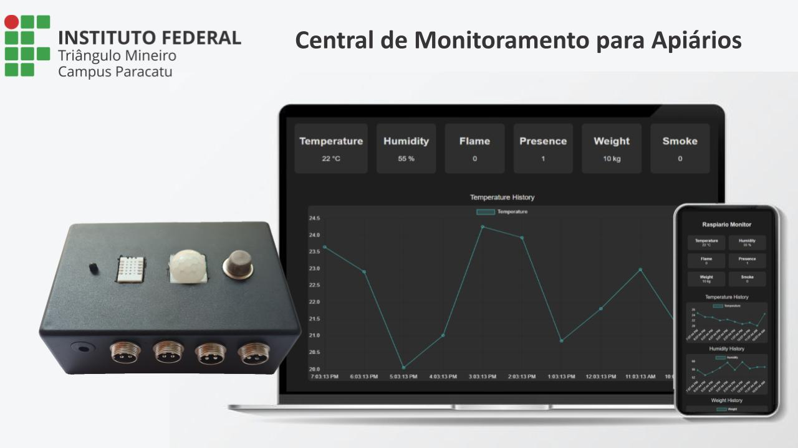

# RaspiarIO - Central de Monitoramento para Apiários

Sistema de monitoramento inteligente para colmeias desenvolvido no IFTM Campus Paracatu.

## Sobre o Projeto

O RaspiarIO é um sistema de monitoramento em tempo real para apiários que permite acompanhar diversos parâmetros importantes:

- Temperatura
- Umidade
- Detecção de Chama
- Sensor de Presença
- Peso da Colmeia
- Detecção de Fumaça

O sistema oferece uma interface web responsiva e um aplicativo móvel para visualização dos dados em tempo real e histórico de medições.